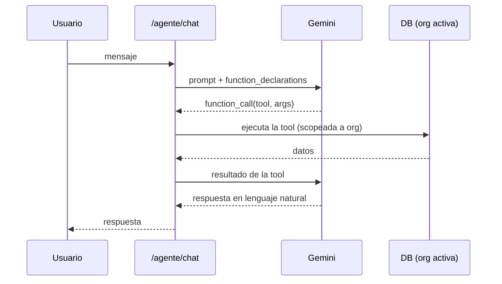

# AI_GUIDE — Asistente IA (Gemini)

> La IA *runtime del producto*: el asistente conversacional, OCR y voz, todo sobre Gemini.
> **No** confundir con la "IA Nivel 2" de aprendizaje de conciliación (patrones de corrección),
> que es lógica de negocio y está documentada en [BUSINESS_RULES](../business/BUSINESS_RULES.md).

Fuente principal: `backend/app/routers/agente.py` · Frontend: `frontend/src/components/AgenteChat.tsx`.

## Activación (feature flag)

- Requiere `GEMINI_API_KEY` en Render. Sin ella, los endpoints responden **503** ("Agente no
  configurado") — degradación elegante, no rompe el resto del sistema.
- Modelo configurable con `GEMINI_MODEL` (default `gemini-2.5-flash`).
- Hay **cuotas diarias** en memoria (chat y OCR) para acotar costo.

## Endpoints (`/agente`)

| Endpoint | Método | Función |
|---|---|---|
| `/agente/chat` | POST | Chat en lenguaje natural con function-calling sobre datos reales |
| `/agente/saludo-proactivo` | GET | Saludo automático con lo importante del día (2-4 oraciones) |
| `/agente/ocr-transferencia` | POST | OCR de comprobante de transferencia (importe, fecha, beneficiario, referencia) |
| `/agente/ocr-cheque` | POST | OCR de cheque |
| `/agente/transcribir` | POST | Transcripción de audio a texto (dictado por voz) |
| `/agente/ocr-usage` | GET | Cuota de OCR restante |

## Chat: tools (function-calling)

El chat declara funciones que Gemini puede invocar; cada una consulta la DB **scopeada a la
organización activa** (multi-tenant, ver [SECURITY_MODEL](../security/SECURITY_MODEL.md)). Tools
declaradas en `_run_chat_message`:

| Tool | Qué responde |
|---|---|
| `consultar_pagos_cliente` | Pagos/acreditaciones de un cliente (con rango de fechas) |
| `consultar_cheques` | Cheques por estado |
| `consultar_saldo_caja` | Saldo de caja |
| `buscar_cliente` | Resuelve un cliente por nombre |
| `resumen_financiero` | Resumen del mes/año |
| `consultar_alertas` | Alertas (reusa `reportes_service.calcular_alertas`) |
| `explicar_filas_pendientes` | Por qué una planilla no concilió (filas con `status != ok` + comentario de revisión) |

El prompt del sistema pide comportamiento **proactivo** (chequear alertas/resumen ante saludos) y
**explicativo** (nunca un número sin contexto). Ver `_run_chat_message` y `chat`/`saludo_proactivo`.

## OCR y voz

- OCR (`ocr-transferencia`, `ocr-cheque`): la imagen se envía a Gemini con un prompt de extracción;
  devuelve JSON con los campos. El frontend (`pages/Pagos.tsx`) comprime la imagen antes de enviar.
- Transcripción (`transcribir`): audio → texto, para dictado por voz desde el celular.

## Manejo de errores

`_classify_gemini_error` traduce errores de Gemini a códigos/mensajes accionables (ej. 503 si el
modelo configurado no está disponible, sugiriendo cambiar `GEMINI_MODEL`).

## Pendiente de revisar

- Las cuotas diarias son contadores **en memoria del proceso**: se reinician con cada redeploy/cold
  start de Render. Si se necesita cuota persistente, documentar como mejora futura.
