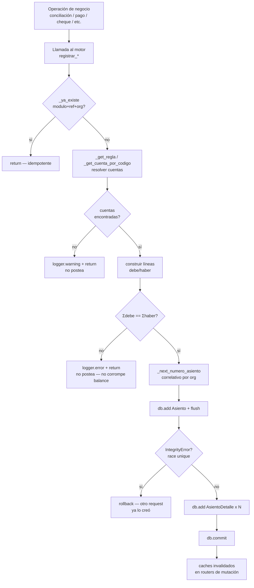

# Motor contable de partida doble

Deep dive del motor contable de Cuadra: cómo se genera, numera, reversa y reporta
cada asiento de partida doble que el sistema produce automáticamente.

Fuentes de verdad (código):
- `backend/app/services/motor_contable.py` — generación de asientos por módulo.
- `backend/app/services/seed_contable.py` — plan de cuentas + reglas sembradas por org.
- `backend/app/models/contabilidad.py` — modelos `PlanCuenta`, `ReglaContable`, `Asiento`, `AsientoDetalle`.
- `backend/app/routers/ctb_plan.py`, `ctb_libro.py`, `ctb_ctas_corrientes.py`, `ctb_clientes.py`, `ctb_common.py` — API de consulta/admin.

Cross-ref: [DOMAIN_MODEL](DOMAIN_MODEL.md) (entidades), [EVENTS](EVENTS.md) (qué dispara cada asiento),
[../business/BUSINESS_RULES](../business/BUSINESS_RULES.md) (reglas de negocio detrás de cada matriz de cuentas),
[../database/DATABASE_RULES](../database/DATABASE_RULES.md) (Decimal, índices, constraints).

---

## 1. Principios

El motor es un subsistema **pasivo y best-effort** que observa operaciones de los demás
módulos (conciliación, pagos, cheques, tarjetas, liquidaciones, ARCA) y genera el asiento
contable correspondiente. Cuatro invariantes:

1. **Encapsulado en try/except**: si falla la generación del asiento, la operación de
   negocio principal **no se revierte** (`db.rollback()` local + `logger.warning`, nunca
   propaga la excepción). El asiento es un efecto secundario, no parte de la transacción
   de negocio.
2. **Idempotente**: nunca crea dos asientos para el mismo `(modulo, referencia_id, org_id)`.
   Ver `_ya_existe()` y el índice único `uq_asiento_modulo_ref_org` (migración 006).
3. **Partida doble obligatoria**: todo asiento tiene Σdebe = Σhaber. Las funciones
   multilínea rechazan postear si no cuadra (red de seguridad, `> 0.01` de diferencia).
4. **Montos en `Decimal`**: todo cálculo monetario usa `Decimal`, nunca `float`
   (ver [DATABASE_RULES](../database/DATABASE_RULES.md), BUGS.md "Decimal vs float").
   `_monto()` normaliza cualquier entrada (`"15.000,50"`, `$`, `None`) a `Decimal` con 2 decimales.

---

## 2. Plan de Cuentas (`PlanCuenta`)

Árbol jerárquico de cuentas, sembrado por organización en `seed_contable.py`.

### Estructura

| Campo | Tipo | Significado |
|-------|------|-------------|
| `codigo` | String, indexado | Código jerárquico tipo `1-1-1-3-1` |
| `nombre` | String | Nombre legible |
| `tipo` | String | `activo` \| `pasivo` \| `resultado` (NULL en nodos sin propagar) |
| `parent_id` | FK self | Cuenta padre (jerarquía) |
| `nivel` | Integer | Profundidad (1 = raíz) |
| `activo` | Boolean | Soft-disable |
| `tasa_iva` | Numeric(5,4) | % IVA de la cuenta (0.21, 0.105, 0=exento, NULL=no aplica) — usado por el módulo IVA |
| `organizacion_id` | FK org | Multi-tenant |

El **código** codifica la jerarquía por segmentos (`A-B-C-D[-E]`): el primer dígito marca el
tipo raíz (`1`=Activo, `2`=Pasivo, `3`=Resultado). Una cuenta es **hoja** si ninguna otra la
tiene como `parent_id` (validado al postear ajustes manuales en `ctb_libro.py`).

### Cuentas sembradas (`PLAN` + `PLAN_PATCH`)

`PLAN` es el esqueleto base; `PLAN_PATCH` agrega cuentas de módulos posteriores y se
re-aplica en cada arranque (idempotente). Cuentas clave que el motor referencia por código:

| Código | Nombre | Tipo | Usada por |
|--------|--------|------|-----------|
| `1-1-1-2` | Efectivo | activo | egresos/ingresos en efectivo |
| `1-1-1-3` | Banco | activo | regla `carga_extracto` |
| `1-1-1-3-1` | Banco Macro (hoja) | activo | UM, egresos banco, liquidaciones, tarjetas, cc_inicial |
| `1-1-2-1` | Cheques en cartera | activo | cheques |
| `1-1-2-4/5/6` | IVA Crédito Fiscal / Percepciones IIBB / Retenciones | activo | tarjetas |
| `2-1-1-1` | No identificado | pasivo | UM import / reclasificación |
| `2-1-2-0` | Cliente (nodo padre) | pasivo | padre de las cuentas corrientes de cliente |
| `2-1-2-X` | Green / Tucu / Alojando / … | pasivo | cuenta corriente por cliente |
| `2-1-3-1` | Cheques depositados | pasivo | cheques |
| `2-1-4-0 / 2-1-5-0 / 2-1-6-0` | Sueldos a pagar / Cargas sociales / Retención Ganancias | pasivo | sueldos |
| `2-2-1-0` | IVA Débito Fiscal | pasivo | ARCA |
| `3-1-1-0` | Comisiones | resultado | comisión planilla / liquidación |
| `3-1-3-0` | Comisiones cheques | resultado | cheques |
| `3-1-4-0` | Ingresos por tarjetas | resultado | tarjetas |
| `3-1-5-0` | Ventas facturadas (ARCA) | resultado | ARCA |
| `3-2-0-0` | Gastos | resultado | egreso proveedor/gasto |
| `3-2-2-1` | Gastos de rechazos | resultado | rechazo de cheque |
| `3-2-3-1/2/3` | Aranceles Visa/Mastercard/Amex | resultado | tarjetas |
| `3-2-4-0` | Sueldos y cargas sociales | resultado | sueldos |

> El plan completo (lista `PLAN` + `PLAN_PATCH`) vive en `seed_contable.py`; este doc cita
> solo las cuentas que el motor resuelve por código.

### Cuentas corrientes de cliente (`2-1-2-X`)

Cada cliente tiene **1:1** una cuenta contable bajo el nodo padre `2-1-2-0`. La resolución
está centralizada en `_get_o_crear_cuenta_cliente()`:

1. Si el cliente ya tiene `cuenta_contable_id` → la reutiliza.
2. Si existe una cuenta bajo `2-1-2-0` con el **mismo nombre** (caso seed: Green/Tucu/Alojando)
   → la adopta y vincula.
3. Si no existe ninguna → crea `2-1-2-{n}` (n = max+1, o el primer hueco libre si
   `reusar_huecos=True`) y la vincula.

Nunca crea entidades `Cliente`, solo la cuenta contable del cliente que ya existe. La
asignación/corrección manual está en `ctb_clientes.py` (`PUT /clientes/{id}/cuenta`,
`POST /clientes/{id}/cuenta/crear`, `POST /clientes/cuentas/crear-faltantes`).

---

## 3. Modelo de asiento

```
Asiento                          AsientoDetalle (1..N líneas)
├─ numero_asiento (correlativo)  ├─ asiento_id (FK)
├─ fecha (Date, negocio/ART)     ├─ cuenta_id (FK PlanCuenta)
├─ descripcion                   ├─ debe  (Numeric(12,2))
├─ modulo                        └─ haber (Numeric(12,2))
├─ referencia_id (FK lógico)
├─ organizacion_id
├─ usuario_id
└─ created_at (UTC, auditoría)
```

- `modulo` + `referencia_id` identifican el **origen** (FK lógico al registro de negocio) y
  son la clave de idempotencia junto con `organizacion_id`.
- `lineas` se cascadean (`cascade="all, delete-orphan"`).
- `fecha` es fecha de **negocio** en ART (`hoy_art()`); `created_at` es timestamp UTC de
  auditoría — distinción deliberada (ver BUGS.md "Fechas ART").

### Flujo de generación de un asiento



### Helpers internos

| Helper | Rol |
|--------|-----|
| `_get_regla(evento, org)` | Busca la `ReglaContable` activa de un evento |
| `_get_cuenta_por_codigo(codigo, org)` | Resuelve una cuenta activa por código |
| `_get_o_crear_cuenta_cliente(cliente_id, org)` | Resuelve/crea/vincula la cuenta `2-1-2-X` del cliente |
| `_ya_existe(modulo, ref, org)` | Chequeo de idempotencia |
| `_next_numero_asiento(org)` | `max(numero_asiento)+1` por org |
| `_monto(v)` | Normaliza cualquier valor a `Decimal` 2 decimales |
| `_crear_asiento(...)` | 2 líneas a partir de una `ReglaContable` |
| `_crear_asiento_directo(...)` | 2 líneas con cuentas explícitas (debe/haber por ID) |
| `_crear_asiento_multilinea(lineas)` | N líneas, con red de seguridad de balanceo |

---

## 4. ReglaContable

Mapea un `evento` a un par `(cuenta_debe, cuenta_haber)`, por organización. Permite cambiar
el destino contable de un evento sin tocar código. Sembradas en `seed_contable.REGLAS`:

| Evento | Debe | Haber |
|--------|------|-------|
| `carga_extracto` | 1-1-1-3 Banco | 2-1-0-0 Pasivo Corriente |
| `carga_planilla` | 2-1-0-0 | 2-1-2-0 Cliente |
| `carga_planilla_comision` | 2-1-2-0 | 3-1-1-0 Comisiones |
| `carga_efectivo` | 1-1-1-2 Efectivo | 1-1-1-3 Banco |
| `carga_cheque` / `carga_cheque_comision` | 1-1-2-1 | 2-1-2-0 / 3-1-3-0 |
| `pago_cliente_banco` / `_efectivo` | 2-1-2-0 | 1-1-1-3 / 1-1-1-2 |
| `asig_gasto_banco` / `_efectivo` | 3-2-0-0 Gastos | 1-1-1-3 / 1-1-1-2 |

> No todos los `registrar_*` usan `ReglaContable`: los flujos con cuentas dinámicas (cliente,
> banco elegido, multilínea) resuelven cuentas por código directamente. Las reglas se usan en
> `registrar_extracto`, `registrar_planilla`, `registrar_ingreso_efectivo`.

---

## 5. Asientos automáticos por módulo

Cada función `registrar_*` produce su asiento. La partida doble está documentada en el
docstring de cada una. Resumen:

### Conciliación / UM (cuenta corriente de cliente)

| Función | Módulo(s) | Asiento |
|---------|-----------|---------|
| `registrar_um_import` | `um_lote` (agrupado) / `um_mov` (individual) | Banco Macro D / No identificado H (ingreso); invertido si egreso. Modo según config org `modo_asiento_um` |
| `registrar_reclasificacion_um` | `um_reclass` | No identificado D / Cliente X H (per-fila, legacy) |
| `registrar_reclasificacion_planilla` | `um_reclass_planilla` (+ `_comision`) — origen UM<br>`reclass_planilla_extracto` (+ `_comision`) — origen extracto principal | Origen D / Cliente X H por el **NETO** + Origen D / Comisiones ganadas H por la comisión (asiento aparte, solo si `comision_pct > 0`). Agrupado por planilla, **upsert** en re-conciliación. Tratamiento acordado con el contador (ago 2026) — ver `BUSINESS_RULES.md` §4.1bis. |
| `registrar_planilla` | `planilla` / `planilla_comision` | Pasivo Corriente D / Cliente **madre genérica** H (+ comisión opcional). **Dead code**: ya no la llama nada (el backfill de arranque que la invocaba se eliminó, ago 2026, por duplicar asientos y no resolver la cuenta por cliente) — queda solo por sus tests, no reintroducir su uso. |
| `registrar_extracto` | `extracto` | Banco D / Pasivo Corriente H (total del extracto) |
| `registrar_cc_inicial` | `cc_inicial` | Banco Macro D / Cliente H — backfill histórico de cta. cte. |

El flujo vivo es: `um_lote` deja el dinero en **No identificado** (2-1-1-1) y `extracto` lo
deja en **Pasivo Corriente** (2-1-0-0); al conciliar una planilla, `registrar_reclasificacion_planilla`
reclasifica CADA origen por separado hacia la cuenta del cliente (neto) + Comisiones ganadas
(comisión), según de qué cuenta salió realmente la plata — mezclar el origen dejaría una de
las dos cuentas mal (nunca se cancela, o queda negativa). Una planilla con filas de ambos
orígenes genera dos pares de asientos independientes. Por eso el reset-y-rebuild solo
reconstruye estos módulos (ver §7).

### Egresos / Pagos (`registrar_egreso`, módulo `egreso`)

Una sola función para proveedor/gasto/pago_cliente, en banco o efectivo. Matriz:

- `tipo=pago_cliente` → Debe: cuenta del cliente `2-1-2-X`
- `tipo=proveedor`/`gasto` → Debe: Gastos `3-2-0-0`
- `forma_pago=banco` → Haber: Banco Macro `1-1-1-3-1`
- `forma_pago=efectivo` → Haber: Efectivo `1-1-1-2`

### Caja (`registrar_ingreso_efectivo`, módulo `caja_efectivo`)

Reposición banco → caja: Efectivo D / Banco H. **Upsert** por arqueo (si ya existe, actualiza
el monto en vez de duplicar).

### Cheques

| Función | Módulos | Asiento |
|---------|---------|---------|
| `registrar_cheque` | `cheque_registro` | Cheques en cartera (1-1-2-1) D / Cheques depositados (2-1-3-1) H neto + Comisiones cheques (3-1-3-0) H |
| `acreditar_cheque` | `cheque_acred_banco`, `cheque_acred_cliente` | A1: Banco D / Cheques en cartera H · A2: Cheques depositados D / Cliente H (neto) |
| `rechazar_cheque` | `cheque_rechazo_banco`, `_cliente`, `_gasto` | A1: Cliente D / Banco H (reversión) · A2: Cliente D / Gastos rechazos H · A3: Gastos rechazos D / Banco H |

### Liquidaciones de cliente (`registrar_liquidacion_aprobacion`, módulo `liquidacion_aprobacion`)

Por cada detalle (cliente): Cliente `2-1-2-X` D conciliado / Banco Macro H neto + Comisiones
ganadas (3-1-1-0) H comisión. Exige la cuenta de comisiones si hay comisión (sino el asiento
descuadraría: neto < conciliado).

### Liquidaciones de tarjeta (`registrar_liquidacion_tarjeta`, módulo `tarjeta_liq`)

Asiento mensual multilínea por marca: Banco D neto + Aranceles (3-2-3-X por marca) D + IVA CF
(1-1-2-4) D + Percepciones IIBB (1-1-2-5) D + Retenciones (1-1-2-6) D / Ingresos por tarjetas
(3-1-4-0) H bruto. Cuenta de arancel según marca (`_ARANCEL_CUENTA_POR_MARCA`, fallback 3-2-3-0).

### Sueldos / F931 (`registrar_liquidacion_sueldos`, módulo `sueldos_liquidacion`)

Agrupado por período: Sueldos y cargas sociales (3-2-4-0) D = bruto+contrib / Sueldos a pagar
(2-1-4-0) H neto + Cargas sociales a pagar (2-1-5-0) H aportes+contrib + Retención de Ganancias
a depositar (2-1-6-0) H ret (si >0). El docstring prueba el balanceo: D = bruto+contrib =
neto + aportes + contrib + ganancias = H.

### ARCA — facturación electrónica (`registrar_factura_arca`, módulo `arca_factura`)

Al obtener el CAE: Cliente `2-1-2-X` D total / Ventas (3-1-5-0) H neto + IVA Débito Fiscal
(2-2-1-0) H iva. Sin cliente vinculado no postea (el comprobante con CAE sigue válido, solo
queda sin reflejo en el Libro Diario). Módulo **construido pero desactivado** en producción
(ver CLAUDE.md "Activación de ARCA").

### Ajuste manual (`registrar_ajuste_manual`, módulo `ajuste_manual`)

Asiento libre debe/haber posteado desde `POST /contabilidad/asiento-manual`
(`require_permission("admin_accounting")`). **No es idempotente**: cada llamada crea un asiento
nuevo. Validaciones del router: cuentas distintas, ambas hoja, monto > 0, fecha válida.

---

## 6. Inmutabilidad y reversión

Los asientos emitidos son **inmutables** en sus líneas: no se editan ni se borran montos. La
corrección se hace por **reverso**, preservando la trazabilidad (original + reverso quedan
ambos en el libro):

- `reversar_asientos(modulo, referencia_id, org)` → crea asientos `{modulo}_reverso` con
  `debe ↔ haber` invertidos. Idempotente: no duplica si ya hay un reverso para ese origen.
  Se dispara cuando se da de baja el registro de origen.
- `DELETE /contabilidad/asientos/{id}` solo admite reversar asientos de **`ajuste_manual`**
  (crea `ajuste_manual_reverso`); rechaza el resto.
- Única excepción editable: la **fecha** de un asiento (`PATCH /asientos/{id}/fecha`,
  `admin_accounting`) y el fix masivo de timezone (`POST /fix-fechas-utc`) — corrigen fecha de
  negocio, nunca montos.

La cuenta corriente del cliente (`ctb_ctas_corrientes.py`) marca como `"Revertido"` tanto el
asiento `*_reverso` como su original (detecta `Asiento.modulo.like("%_reverso")` apuntando al id).

---

## 7. Numeración correlativa y reset-y-rebuild

- `numero_asiento` es un correlativo **por organización** (`_next_numero_asiento` = max+1).
  Es número de visualización; el `id` sigue siendo la PK real. Indexado (migración 011 /
  safety net `idx_asientos_numero`).
- `GET /contabilidad/asientos/gaps` reporta huecos en la secuencia (auditoría de saltos).
- **Sin tombstones de huecos legacy** (desde ago 2026): hasta el reset operativo, el arranque
  (`main.py` paso 9b) re-sembraba 3 asientos "lápida" (`numero_asiento` 518/519/520, sin detalle)
  para tapar los huecos de la baja física de la migración v3.9. Ese backfill se eliminó al vaciar
  el Libro Diario a cero — ya no hay huecos que tapar y evitaba que el primer asiento nuevo se
  numerara 521 en vez de 1. No reintroducir salvo que se restaure el histórico.
- `POST /contabilidad/reset-y-rebuild` (solo superadmin, `dry_run` por defecto) **borra todos
  los asientos de la org y los reconstruye** desde los datos reales: un `um_lote` por lote de
  UM importado + un bucket de reclasificación por `(planilla, origen del movimiento)` — mismo
  criterio dual que el flujo vivo (extracto principal → Pasivo Corriente, UM → No identificado),
  neteando la comisión de la planilla en un asiento aparte cuando corresponde — luego renumera
  correlativamente 1..N por `(fecha, id)`. Incluye self-heal de la columna `numero_asiento` por
  si Render no corrió el safety net.
  > **Ojo**: borra TODOS los asientos de la org, incluidos los de módulo `extracto` (Banco D /
  > Pasivo Corriente H al importar el extracto bancario) — y **no los reconstruye** (este
  > endpoint no toca ese módulo). Usarlo asume que se puede re-generar `extracto` de otra forma
  > o que se acepta perderlo. Gap preexistente, no introducido por el cambio de ago 2026.

---

## 8. Reportes derivados

Todos son **vistas de solo lectura** sobre `Asiento`/`AsientoDetalle` — no generan asientos.
Endpoints bajo el prefijo `/contabilidad`:

| Reporte | Endpoint | Qué calcula |
|---------|----------|-------------|
| Libro Diario | `GET /asientos`, `GET /asientos/{id}` | Lista paginada de asientos + detalle de líneas. Filtros: fecha, módulo, cuenta |
| Libro Mayor | `GET /libro-mayor?cuenta_id=` | Movimientos de una cuenta con **saldo acumulado** (Σ debe − haber) |
| Sumas y Saldos | `GET /sumas-saldo` | Total debe/haber por cuenta + saldo deudor/acreedor. Cacheado 60s |
| Balance | `GET /balance` | Totales por tipo (activo/pasivo/resultado) + chequeo `ecuacion_ok` (A = \|P\| + \|R\|). Cacheado 60s |
| Cartera (todos los clientes) | `GET /cuentas-corrientes` | Saldo + último mov + estado (deudor/acreedor/equilibrado) por cliente. Cacheado 60s |
| Cuenta corriente (un cliente) | `GET /cuenta-corriente?cliente_id=` | Línea de tiempo financiera del cliente con saldo, contraparte y origen de cada asiento; PDF en `/cuenta-corriente/exportar-pdf` |
| Export contable | `GET /asientos/exportar-contable` | Libro diario en formato CSV / Tango / Holistor / Regisoft (`view_accounting`) |

Los caches de Sumas/Saldos, Balance y Cartera se **invalidan explícitamente** tras cada
mutación de asientos (`_invalidar_reportes` en `ctb_libro.py`), con el TTL de 60s como respaldo.

---

## 9. Permisos

| Acción | Permiso |
|--------|---------|
| Leer plan, reglas, asientos, reportes | `get_current_user` (autenticado) |
| Cuentas corrientes | `manage_finance` |
| Export contable | `view_accounting` |
| Asiento manual, editar fecha, vincular cuentas, backfill, fix-fechas | `admin_accounting` |
| `reset-y-rebuild` (ejecutar) | `is_superadmin` |

Ver [../security/SECURITY_MODEL](../security/SECURITY_MODEL.md) para el modelo de permisos completo.

---

## Pendiente de revisar

- **Reglas sembradas vs. usadas**: `seed_contable.REGLAS` incluye eventos
  (`carga_cheque`, `carga_cheque_comision`, `acred_rechazo_banco`, `acred_rechazo_pasivo`,
  `pago_cliente_banco`, `pago_cliente_efectivo`, `asig_gasto_banco`, `asig_gasto_efectivo`) que
  el motor **no** consume directamente — los flujos de cheques/egresos resuelven cuentas por
  código en vez de por `ReglaContable`. Conviene confirmar si son reglas legacy o se mantienen
  por compatibilidad/configurabilidad.
- **`_MODULO_TIPO` (ctb_common.py)** mapea módulos a etiquetas legibles, pero no incluye
  `tarjeta_liq`, `sueldos_liquidacion`, `arca_factura`, `um_lote`, `extracto`, `caja_efectivo`
  ni `ajuste_manual`; esos caen en el fallback `("ajustes", modulo)`. Revisar si falta agregar
  etiquetas para que aparezcan con nombre legible en la cuenta corriente.
- **Comentario en `models/contabilidad.py`** (`Asiento.modulo`) lista solo
  `extracto|planilla|caja|cheque` como ejemplos; el conjunto real de módulos es mucho mayor
  (ver §5). Es solo un comentario ilustrativo, no afecta comportamiento.
