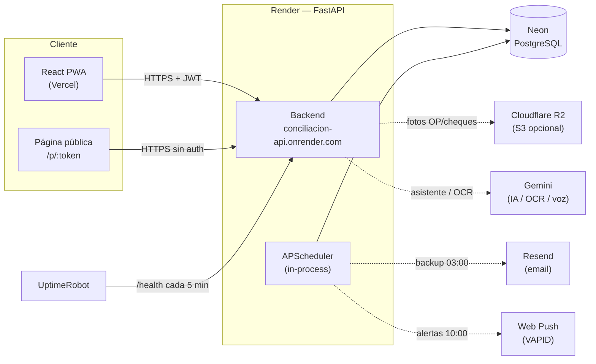
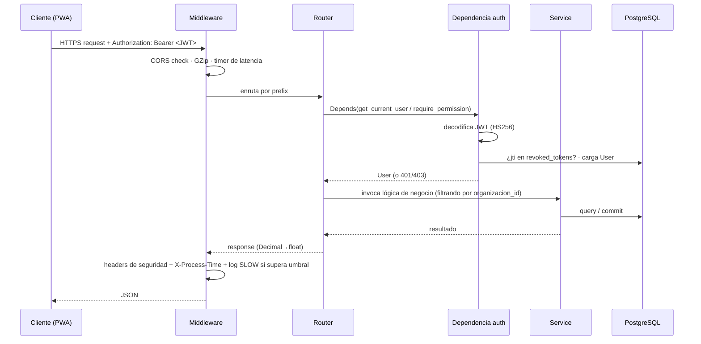

# Arquitectura — Cuadra (Conciliación Bancaria y Gestión Financiera)

> Visión de alto nivel de la arquitectura del sistema. Para el mapa navegable
> "dónde está cada cosa" ver [SYSTEM_MAP.md](./SYSTEM_MAP.md); para entidades y
> relaciones ver [DOMAIN_MODEL.md](./DOMAIN_MODEL.md); para efectos secundarios
> de cada acción ver [EVENTS.md](./EVENTS.md).

---

## 1. Stack tecnológico

### Backend
- **FastAPI** (Python 3.11) — framework HTTP asíncrono.
- **SQLAlchemy** (ORM) + **PostgreSQL** (Neon en producción; SQLite como fallback
  local de desarrollo, ver `backend/app/config.py` → `database_url`).
- **Alembic** — versionado de esquema (migraciones en `backend/alembic/versions`).
- **APScheduler** — schedulers in-process (backup, push, cleanup).
- **slowapi** — rate limiting (protección brute force).
- **Pydantic / pydantic-settings** — schemas y configuración por env vars.

### Frontend
- **React 18 + TypeScript + Vite** — SPA.
- **TailwindCSS** — diseño (Linear-inspired, dark mode `#0B0B0F`, fuente Inter).
- **PWA instalable** — service worker en `frontend/src/public/sw.js`
  (network-first + share target + web push).

### Auth y seguridad
- **JWT** (HS256, expira a las 8 h = jornada laboral, `access_token_expire_minutes=480`).
- **pbkdf2_sha256** para passwords.
- Rate limiting + headers de seguridad bancaria (ver §5).
- Detalle completo en [../security/SECURITY_MODEL.md](../security/SECURITY_MODEL.md).

---

## 2. Arquitectura en capas

El backend sigue una separación clásica en capas. El flujo de dependencias va de
arriba hacia abajo:

```
  Cliente (React PWA / página pública / app móvil)
        │  HTTPS + JWT
        ▼
  ┌──────────────────────────────────────────────┐
  │  Middleware       (CORS · GZip · headers ·    │
  │                    rate limit · latencia)     │  backend/app/main.py
  ├──────────────────────────────────────────────┤
  │  Routers          (endpoints HTTP, permisos,  │  backend/app/routers/
  │                    validación de entrada)     │
  ├──────────────────────────────────────────────┤
  │  Schemas          (Pydantic — request/response)│ backend/app/schemas/
  ├──────────────────────────────────────────────┤
  │  Services         (lógica de negocio:         │  backend/app/services/
  │                    conciliación, motor        │
  │                    contable, parsers, export) │
  ├──────────────────────────────────────────────┤
  │  Models           (SQLAlchemy ORM)            │  backend/app/models/
  ├──────────────────────────────────────────────┤
  │  Base de datos    (PostgreSQL / Neon)         │
  └──────────────────────────────────────────────┘
```

- **Models** (`backend/app/models/`) — entidades ORM. Casi todas llevan
  `organizacion_id` (multi-tenant) y muchas `deleted_at` (soft delete). Ver
  [DOMAIN_MODEL.md](./DOMAIN_MODEL.md).
- **Schemas** — modelos Pydantic para validar entrada y serializar salida.
- **Services** — lógica de negocio reutilizable y desacoplada del transporte
  HTTP: `conciliacion.py`, `motor_contable.py`, `excel_parser.py`,
  `excel_export.py`, los servicios de impuestos, etc.
- **Routers** — definen los endpoints, aplican permisos en 3 capas y delegan en
  services. Convenciones en [../api/API_RULES.md](../api/API_RULES.md).
- **Middleware** — se monta en `main.py` y envuelve todas las requests.

---

## 3. Topología de producción

| Capa | Servicio | URL / Identificador |
|---|---|---|
| Frontend (React + PWA) | **Vercel** | https://conciliacion-bancaria-ten.vercel.app |
| Backend (FastAPI) | **Render** (free tier) | https://conciliacion-api.onrender.com · `srv-d7pqt81j2pic73c0c6fg` |
| Base de datos | **Neon PostgreSQL** (free tier) | ep-ancient-hall-anz4pezn… |
| Keep-alive | **UptimeRobot** | pinguea `/health` cada 5 min |
| Código | **GitHub** (privado) | julietaarrazate/conciliacion-bancaria |



> Notas de free tier (ver `CLAUDE.md`): Render tiene cold start ~30 s (mitigado
> con UptimeRobot + retry en el frontend) y Neon puede "dormir". Existe además
> documentación de despliegue alternativo en Railway (`DEPLOY_RAILWAY.md`).

---

## 4. Ciclo de vida de un request



Detalle por etapa:

1. **Middleware** (`backend/app/main.py`): orden de montaje — `GZipMiddleware`
   (comprime respuestas > 500 bytes), `CORSMiddleware` (cerrado al dominio de
   Vercel + previews + dev local), y el middleware `security_headers` que mide
   latencia y agrega headers de seguridad.
2. **Auth** (`backend/app/middleware/auth.py`): `get_current_user` usa
   `HTTPBearer`, decodifica el JWT, verifica que el `jti` no esté en
   `revoked_tokens` y carga el `User`. `require_superadmin` y
   `require_permission(<perm>)` son las dependencias de autorización.
3. **Router**: aplica permisos y filtra por `organizacion_id` del usuario
   (multi-tenant — ver [DOMAIN_MODEL.md](./DOMAIN_MODEL.md) §multi-tenant).
4. **Service**: lógica de negocio. Muchas acciones disparan efectos secundarios
   (auditoría, asientos contables) — ver [EVENTS.md](./EVENTS.md).
5. **Response**: la clase `JSONResponse` custom de `main.py` serializa
   `decimal.Decimal` como `float` (las columnas monetarias son `Numeric`).

---

## 5. Middleware y observabilidad

Definidos en `backend/app/main.py`:

- **`GZipMiddleware`** (`minimum_size=500`) — reduce 60-80 % los bytes en
  endpoints largos (movimientos, planillas, backups, asientos).
- **`CORSMiddleware`** — `allow_origins` cerrado a la URL de producción +
  `localhost` + previews de Vercel (`allow_origin_regex`). `EXTRA_CORS_ORIGINS`
  permite agregar orígenes por env var. `allow_credentials=False`.
- **`security_headers`** (middleware http) — agrega:
  `X-Content-Type-Options`, `X-Frame-Options: DENY`, `Referrer-Policy`,
  `Permissions-Policy`, `Strict-Transport-Security`. Mide la latencia, expone
  `X-Process-Time` y loguea `WARNING SLOW <método> <path> → <status> en <ms>`
  cuando supera `settings.slow_request_ms` (default 1500 ms, ajustable por env).
- **Rate limiting** (`slowapi`) — `Limiter(key_func=get_remote_address)`, con
  handler de `RateLimitExceeded`.
- **Sentry** (opt-in) — `sentry_sdk.init` con `traces_sample_rate=0.05` si está
  seteado `SENTRY_DSN`. `send_default_pii=False`.

Endpoints de salud: `GET /` (status), `GET /health` (usado por UptimeRobot),
`GET /health/db` (chequea conexión a la DB).

---

## 6. Arranque, migraciones y seed (lifespan)

El `lifespan` de FastAPI (`backend/app/main.py`) lanza el arranque pesado en un
**thread daemon** (`_init_db`) para no bloquear el boot — clave en Render free
tier. Ese proceso es **idempotente** y en cada arranque:

1. `Base.metadata.create_all` (crea tablas faltantes).
2. **Alembic** (`_run_alembic`): si la DB nunca tuvo Alembic la sella como
   baseline; si ya lo tenía, aplica `upgrade head`.
3. **Safety net** (`_safety_cols`): `ALTER TABLE … ADD COLUMN IF NOT EXISTS` y
   `CREATE TABLE IF NOT EXISTS` para columnas/tablas que deben existir **aunque
   Alembic falle**. Es una red de seguridad deliberada para un free tier donde
   un deploy parcial no debe romper el sistema.
4. Índices de performance (`CREATE INDEX IF NOT EXISTS`).
5. Backfills multi-tenant (`organizacion_id=1` donde falte) y de fingerprints.
6. Seed de la **Organización A** (`id=1`) con su configuración por defecto.
7. Seed contable **por organización** (plan de cuentas, reglas, categorías de
   egreso, categorías de monotributo, jurisdicción IIBB, config de sueldos).
8. Backfill de asientos contables para extractos/planillas existentes.
9. Seed del superadmin (Julieta) desde `SUPERADMIN_PASSWORD` y, solo en
   `debug=true`, el usuario demo `admin@julieta.com`.

> El detalle de las migraciones de esquema vive en
> [../database/DATABASE_RULES.md](../database/DATABASE_RULES.md). La regla de oro
> "Org A (`organizacion_id=1`) nunca se modifica destructivamente, solo cambios
> aditivos" está en `CLAUDE.md`.

---

## 7. Schedulers (APScheduler in-process)

Se arrancan en el `lifespan` vía `backend/app/services/backup_scheduler.py`.
Corren **dentro del mismo proceso FastAPI** (no hay worker separado), apoyados en
que UptimeRobot mantiene el servicio despierto. Todos usan `CronTrigger` en
timezone **ART (UTC-3)** con `misfire_grace_time=3600` (si quedó dormido, lo
corre dentro de 1 h).

| Job | Hora ART | Condición de activación | Efecto |
|---|---|---|---|
| `backup_diario` | 03:00 | `RESEND_API_KEY` (+ `backup_enabled`) | Backup completo JSON gzipeado por email |
| `token_cleanup` | 03:30 | siempre | Purga tokens revocados / approvals / 2FA vencidos |
| `r2_storage_alert` | 09:00 | `S3_ENDPOINT` + `RESEND_API_KEY` | Email de alerta si R2 > 8 GB |
| `push_alertas_diario` | 10:00 | `VAPID_PRIVATE_KEY` + `VAPID_PUBLIC_KEY` | Push: cheques que vencen ≤3 días + movimientos sin conciliar >7 días |

Detalle de los efectos secundarios en [EVENTS.md](./EVENTS.md) §schedulers.

---

## 8. Filosofía de feature flags (degradación elegante)

El sistema está diseñado para correr aun sin las integraciones opcionales: **sin
la env var, la feature se degrada sola — no rompe**. Las flags se leen en
`backend/app/config.py` y cada módulo chequea su disponibilidad antes de actuar.

| Env var(s) | Feature | Comportamiento sin la var |
|---|---|---|
| `RESEND_API_KEY` | Backup diario por email + 2FA admin | Scheduler no arranca; 2FA degrada |
| `VAPID_PUBLIC_KEY` / `VAPID_PRIVATE_KEY` | Web Push | `send_push` retorna `False`, job no se registra |
| `GEMINI_API_KEY` (+ `GEMINI_MODEL`) | Asistente IA / OCR / transcripción | Endpoints de IA degradan |
| `SENTRY_DSN` | Monitoreo de errores | No se inicializa Sentry |
| `GOOGLE_CLIENT_ID` / `GOOGLE_CLIENT_SECRET` | Login con Google | Login Google deshabilitado |
| `S3_*` (5 vars) | Storage de fotos en R2 | Fotos se guardan como base64 en la DB |
| `ARCA_ENCRYPTION_KEY` | Facturación electrónica ARCA | Módulo no permite cargar certificados (falla explícito) |
| `SUPERADMIN_PASSWORD` | Seed del superadmin | Loguea warning, no crea superadmin |

Principio general: **opt-in y degradación silenciosa**, salvo ARCA que falla
explícito por seguridad (no se cifran certificados sin key). Ver `CLAUDE.md`
("Env vars opcionales en Render") y `COSTEO.md` para el detalle de costos.

---

## Cross-referencias

- Mapa módulo → router → service → modelo → página: [SYSTEM_MAP.md](./SYSTEM_MAP.md)
- Entidades y ERD: [DOMAIN_MODEL.md](./DOMAIN_MODEL.md)
- Efectos secundarios / eventos de dominio: [EVENTS.md](./EVENTS.md)
- Motor contable (partida doble): [ACCOUNTING_ENGINE.md](./ACCOUNTING_ENGINE.md)
- Seguridad: [../security/SECURITY_MODEL.md](../security/SECURITY_MODEL.md)
- Base de datos y migraciones: [../database/DATABASE_RULES.md](../database/DATABASE_RULES.md)
- Reglas de API: [../api/API_RULES.md](../api/API_RULES.md)

---

## Pendiente de revisar

- ~~**Versión declarada**: `FastAPI(version="2.0.0")` desalineada de v3.24~~ →
  **CORREGIDO** (Fase 2): `version="3.24.0"` en `main.py`. Conviene atarla al
  `CHANGELOG.md` a futuro para que no se vuelva a desfasar.
- **Nombre del producto**: el `app_name` en `config.py` es
  "Conciliacion Bancaria — Julieta Arrazate"; `README.md` y la UI usan **"Cuadra"**.
  El branding "Cuadra" no está reflejado en el `app_name` del backend.
- **`dias_tolerancia_fecha` por defecto**: `CONFIG_DEFAULT` en
  `backend/app/models/organizacion.py` lo define en `0`, pero el seed de la Org A
  en `main.py` (`_init_db`) la crea con `dias_tolerancia_fecha=5`. Verificar cuál
  es el valor canónico (`CLAUDE.md` documenta tolerancia de 5 días).
- Los docs `../database/DATABASE_RULES.md`, `../security/SECURITY_MODEL.md`,
  `../api/API_RULES.md` y `ACCOUNTING_ENGINE.md` se referencian aquí pero pueden
  no estar escritos todavía (se generan en otras fases de esta documentación).
