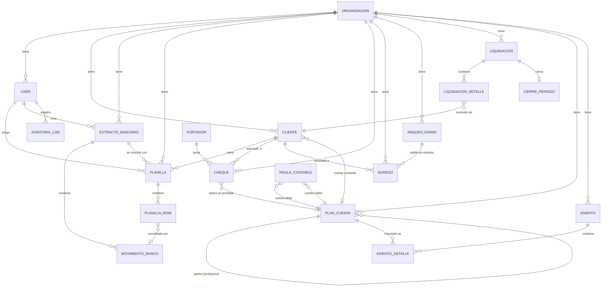
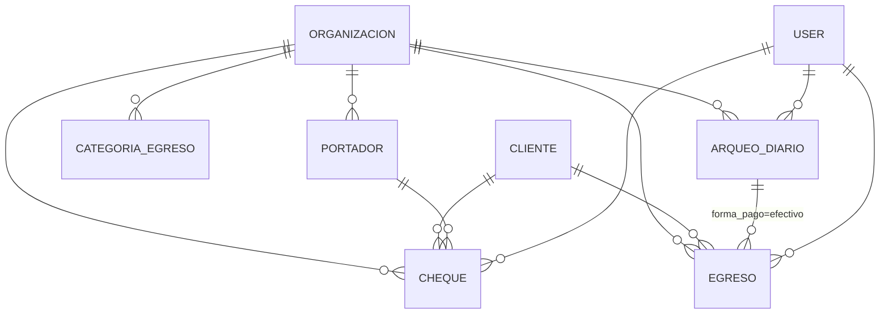
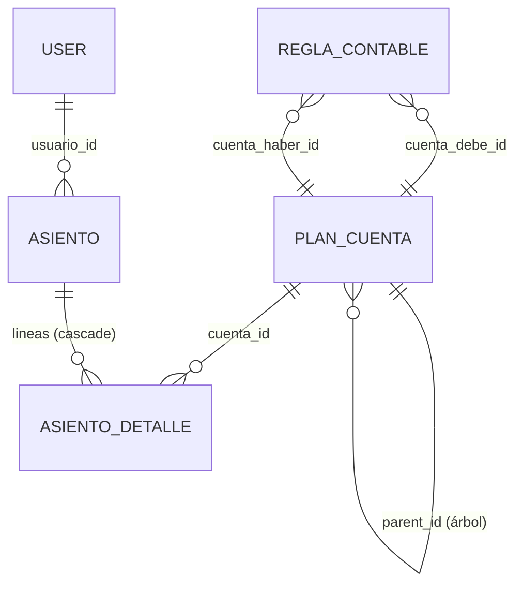
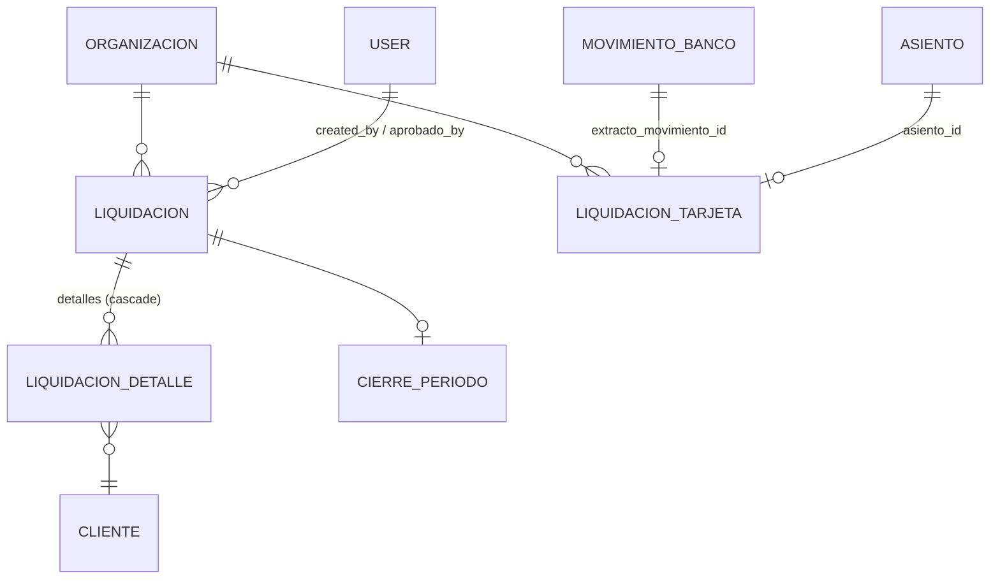
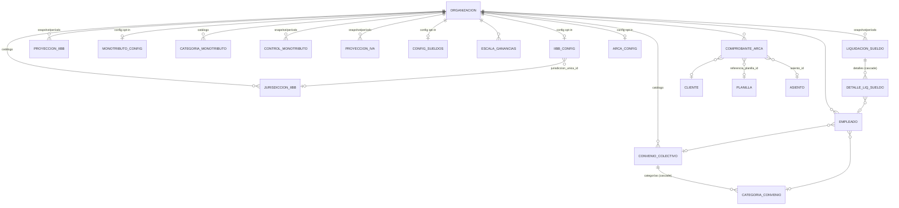

# Modelo de dominio — Cuadra

> Entidades, relaciones y patrones transversales (multi-tenant, soft delete).
> Fuente: `backend/app/models/*.py`. Para el detalle de la partida doble
> (cuentas, reglas, asientos) ver
> [ACCOUNTING_ENGINE.md](./ACCOUNTING_ENGINE.md); para los efectos secundarios de
> cada acción ver [EVENTS.md](./EVENTS.md).

---

## 1. Patrones transversales

### Multi-tenant (`organizacion_id`)
`Organizacion` es la raíz del tenant. **Casi todas las entidades de negocio
llevan `organizacion_id`** (FK a `organizaciones.id`, default `1`). La
Organización A (`id=1`) es la org principal: nunca se modifica
destructivamente, solo cambios aditivos (regla en `CLAUDE.md`).

- Entidades **con** `organizacion_id`: User, Cliente, ExtractoBancario,
  MovimientoBanco, Planilla, PlanillaRow, Cheque, Portador, Egreso,
  CategoriaEgreso, ArqueoDiario, PlanCuenta, ReglaContable, Asiento,
  Liquidacion, CierrePeriodo, LiquidacionTarjeta, PatronAprendido, y todos los
  modelos de impuestos/ARCA/sueldos de configuración y proyección.
- Entidades de **detalle** (hijas, sin `organizacion_id` propio — heredan el de
  su padre): AsientoDetalle, LiquidacionDetalle, CategoriaConvenio,
  DetalleLiquidacionEmpleado.
- Entidades de **infraestructura/auth** (sin `organizacion_id`): AuditoriaLog,
  PasswordResetToken, LoginApproval, TwofaCode, RevokedToken, PushSubscription.

### Soft delete (`deleted_at`)
Solo un subconjunto usa borrado lógico (`deleted_at IS NULL` = activo):
**ExtractoBancario, Planilla, Empleado, LiquidacionTarjeta**. Los demás usan
borrado físico (con FK puestas en NULL en algunos casos, ver `main.py`). El
módulo Papelera (`/admin/papelera`) opera sobre los registros con `deleted_at`.

### Montos (`Numeric`)
Todas las columnas monetarias son `Numeric(12,2)` (o `Numeric(5,4)` para
porcentajes/alícuotas) → en Python son `Decimal`. La `JSONResponse` custom de
`main.py` los serializa como `float`. Ver `BUGS.md` para los cuidados con
`Decimal`.

---

## 2. ERD — núcleo (conciliación + financiero + contabilidad)

### Entidades del núcleo (campos clave)

| Entidad | Tabla | FKs salientes | Notas |
|---|---|---|---|
| `Organizacion` | `organizaciones` | — | Raíz del tenant. `configuracion` (JSON): match_rules, tolerancias, etc. |
| `User` | `users` | `organizacion_id` | `role` ∈ {admin, operador, revisor, auditor, contador}; `is_superadmin`; `allowed_org_ids` (JSON, multi-org del rol contador) |
| `Cliente` | `clientes` | `organizacion_id`, `cuenta_contable_id`→PlanCuenta | porcentajes de comisión (general/local/interior) |
| `ExtractoBancario` | `extractos_bancarios` | `creado_por`→User, `organizacion_id` | `fingerprint` (dedupe), `banco`, **`deleted_at`** |
| `MovimientoBanco` | `movimientos_banco` | `extracto_id`, `organizacion_id` | `monto`, `saldo`, `cliente_acreditado`, `source`, `um_lote`. Cascade delete desde el extracto |
| `Planilla` | `planillas` | `cliente_id`, `extracto_id`, `usuario_id`, `organizacion_id` | **`deleted_at`**, `porcentaje_comision` |
| `PlanillaRow` | `planilla_rows` | `planilla_id`, `orden_movimiento_acreditado`→MovimientoBanco, `organizacion_id` | `status` (resultado de conciliación), `monto`, `cuit`, `titular`, `referencia` |
| `PatronAprendido` | `patrones_aprendidos` | `organizacion_id` | IA Nivel 2: `veces_visto`/`veces_correcto` |

---

## 3. ERD — cheques, egresos y caja

| Entidad | Tabla | Notas |
|---|---|---|
| `Cheque` | `cheques` | `estado` ∈ {registrado, depositado, acreditado, rechazado, anulado}; `local_interior`, `comision`, `foto_comprobante`; FK opcional a `banco_cuenta_id` (PlanCuenta) |
| `Portador` | `portadores` | Solo `nombre` + `organizacion_id` |
| `Egreso` | `egresos` | `tipo` ∈ {proveedor, gasto, pago_cliente}; `forma_pago` ∈ {banco, efectivo}; `arqueo_id` cuando es efectivo; `denominaciones_usadas` (JSON) |
| `CategoriaEgreso` | `categorias_egreso` | Catálogo editable de categorías |
| `ArqueoDiario` | `arqueos_diarios` | Arqueo de caja; `denominaciones` (JSON); recibe los egresos en efectivo vía `back_populates` |

---

## 4. ERD — contabilidad (partida doble)

| Entidad | Tabla | Notas |
|---|---|---|
| `PlanCuenta` | `plan_cuentas` | Árbol de cuentas (`parent_id` auto-referencial); `tipo` ∈ {activo, pasivo, resultado}; `tasa_iva` (para módulo IVA) |
| `ReglaContable` | `reglas_contables` | Mapea un `evento` → (`cuenta_debe`, `cuenta_haber`). Es lo que dispara los asientos automáticos |
| `Asiento` | `asientos` | `numero_asiento` (correlativo por org), `modulo`, `referencia_id` (FK lógico al registro origen). Idempotencia: único por (modulo, referencia_id, org) |
| `AsientoDetalle` | `asiento_detalle` | Líneas `debe`/`haber`. Sin `organizacion_id` (hereda del asiento) |

> El detalle de qué cuentas usa cada evento y la lógica de partida doble está en
> [ACCOUNTING_ENGINE.md](./ACCOUNTING_ENGINE.md).

---

## 5. ERD — liquidaciones y tarjetas

| Entidad | Tabla | Notas |
|---|---|---|
| `Liquidacion` | `liquidaciones` | `estado` ∈ {borrador, aprobada, pagada}; totales conciliado/comisión/neto |
| `LiquidacionDetalle` | `liquidacion_detalles` | Una fila por cliente; guarda `cliente_nombre` como snapshot |
| `CierrePeriodo` | `cierres_periodo` | Cierre del período, opcionalmente atado a una liquidación |
| `LiquidacionTarjeta` | `liquidaciones_tarjeta` | Visa/Mastercard/Amex; bruto/aranceles/iva_df/percepciones/retenciones/neto; **`deleted_at`**; FK opcional al movimiento bancario conciliado y al asiento |

---

## 6. Modelos de impuestos y ARCA

Patrón común: cada módulo tiene una entidad **config opt-in** (única por org,
`activo` por defecto en `False`/`True` según el caso), un **catálogo** editable y
una **proyección/snapshot por período** (con `UNIQUE(organizacion_id, periodo)`).

| Módulo | Config (única/org) | Catálogo | Proyección/Snapshot (UNIQUE org+período) |
|---|---|---|---|
| IVA | — (usa `PlanCuenta.tasa_iva`) | — | `ProyeccionIva` |
| Monotributo | `MonotributoConfig` | `CategoriaMonotributo` (A..K, servicios/bienes) | `ControlMonotributo` (semestral) |
| IIBB | `IIBBConfig` (modo simple/convenio) | `JurisdiccionIIBB` | `ProyeccionIIBB` |
| Sueldos | `ConfigSueldos` (aportes/contrib./ganancias) | `ConvenioColectivo`→`CategoriaConvenio`, `Empleado` (**`deleted_at`**), `EscalaGanancias` | `LiquidacionSueldoPeriodo`→`DetalleLiquidacionEmpleado` |
| ARCA | `ArcaConfig` (cuit, ambiente, certificados cifrados) | — | `ComprobanteArca` (CAE; UNIQUE org+pv+tipo+numero) |

---

## 7. Modelos de auth / infraestructura

| Entidad | Tabla | Notas |
|---|---|---|
| `AuditoriaLog` | `auditoria` | `usuario_id`→User; `tabla`, `registro_id`, `accion`, `cambios` (JSON). Ver [EVENTS.md](./EVENTS.md) |
| `PasswordResetToken` | `password_reset_tokens` | `token_hash`, `expires_at`, `used_at`; FK `user_id` ondelete CASCADE |
| `LoginApproval` | `login_approvals` | Flujo de aprobación de login (rol contador). `status` ∈ {pending, approved, denied, expired} |
| `TwofaCode` | `twofa_codes` | Código 2FA hasheado; `failed_attempts`, `expires_at` |
| `RevokedToken` | `revoked_tokens` | `jti` (PK) revocado; chequeado en cada request |
| `PushSubscription` | `push_subscriptions` | `endpoint` (unique), `p256dh`, `auth` (VAPID) |

> Estos modelos no llevan FK declaradas a `users` en varios casos (`user_id` es
> entero plano) y no tienen `organizacion_id` — son globales del sistema.

---

## Pendiente de revisar

- `ArqueoDiario` (`caja.py`): los campos exactos (`saldo_inicial`,
  `pesos_agregados`, `ingresos`, `denominaciones`, `cerrado`) provienen del
  reporte de exploración; verificar nombres exactos contra el modelo antes de
  citarlos textualmente en código.
- Varios modelos de auth (`LoginApproval`, `RevokedToken`, `PushSubscription`)
  usan `user_id` como entero **sin `ForeignKey`**. Esto es intencional (evita
  restricciones de borrado) pero conviene documentarlo en
  [../database/DATABASE_RULES.md](../database/DATABASE_RULES.md).
- `Cliente` no tiene relación inversa hacia `Cheque`/`Egreso` declarada con
  `back_populates` (la relación existe por FK pero no como `relationship`
  navegable desde Cliente). Confirmar si es deliberado.
- El nombre de clase `ProyeccionIva` vs tabla `proyecciones_iva` y el módulo en
  `proyeccion_iva.py` (singular) — consistente, solo se nota.
