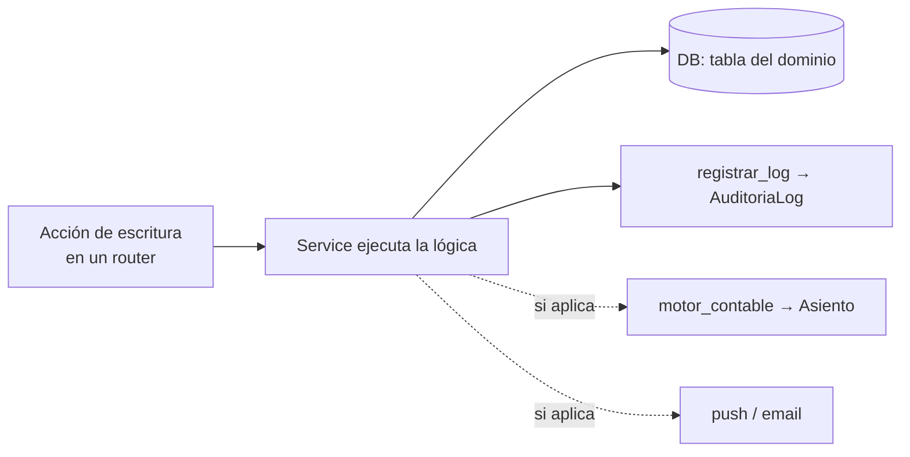

# EVENTS — Eventos de dominio y efectos secundarios

> Qué ocurre "por detrás" cuando se ejecuta una acción del sistema: auditoría, generación
> de asientos contables, notificaciones, backups y tareas programadas. Complementa a
> [SYSTEM_MAP](./SYSTEM_MAP.md) (dónde vive cada cosa) y a
> [ACCOUNTING_ENGINE](./ACCOUNTING_ENGINE.md) (detalle de los asientos).

Cuadra **no** usa un bus de eventos formal: los "eventos" son efectos secundarios que disparan
los servicios de forma síncrona dentro del mismo request, más tareas programadas (APScheduler).
Este documento los inventaria para que sea predecible qué se dispara y dónde.

## 1. Auditoría (`services/auditoria.py` → `registrar_log`)

Casi todas las operaciones de escritura registran una entrada en `AuditoriaLog` vía
`registrar_log(db, user_id, tabla, registro_id, accion, detalle)`. Acciones típicas:
`INSERT`, `UPDATE`, `DELETE`, `UPSERT_ACRED`, etc. El detalle se serializa a JSON (cuidando los
`Decimal`, ver [DATABASE_RULES](../database/DATABASE_RULES.md)).

Se consulta desde `routers/auditoria.py` y la página `Auditoria.tsx` / `Actividad.tsx`.

## 2. Asientos contables (`services/motor_contable.py`)

Varias acciones generan **asientos de partida doble** automáticamente. El detalle de cada
asiento (cuentas, débito/haber, idempotencia) está en
[ACCOUNTING_ENGINE](./ACCOUNTING_ENGINE.md); acá el mapa acción → asiento:

| Acción del usuario | Función del motor | Módulo del asiento |
|---|---|---|
| Importar UM (lote de banco) | `registrar_um_import` | `um_lote` |
| Conciliar planilla contra UM | `registrar_reclasificacion_planilla` | `um_reclass_planilla` |
| Registrar pago/gasto (egreso) | `registrar_egreso` | egreso |
| Registrar ingreso en efectivo | `registrar_ingreso_efectivo` | caja |
| Acreditar/registrar cheque | `registrar_cheque` | cheque |
| Aprobar liquidación | `registrar_liquidacion_aprobacion` | liquidación |
| Liquidar sueldos (F931) | `registrar_liquidacion_sueldos` | sueldos |
| Emitir factura ARCA | (router `arca`) | ARCA |
| Ajuste manual | router `ctb_libro` | `ajuste_manual` |

> El extracto en sí **no** genera asiento propio: los movimientos entran vía `um_lote`
> (ver comentario en `routers/extractos.py`).

Cada mutación de asientos invalida los cachés derivados (cartera, sumas-saldo, balance) — ver
`routers/ctb_libro.py::_invalidar_reportes`.

## 3. Notificaciones push (`services/push_service.py`)

Web Push (VAPID, opt-in con `VAPID_PUBLIC_KEY`/`VAPID_PRIVATE_KEY`). Suscripciones en
`PushSubscription`. Se disparan desde el scheduler de alertas (ver §5) y desde pruebas manuales
en `/perfil`. Sin las claves VAPID, el push se degrada silenciosamente.

## 4. Backups (`services/backup_service.py` + `backup_scheduler.py`)

Backup completo en JSON gzipeado, enviado por email (Resend, opt-in con `RESEND_API_KEY`).
Disponible también on-demand desde `routers/backup_admin.py`.

## 5. Tareas programadas (APScheduler, en el proceso FastAPI)

| Hora (ART) | Tarea | Condición de activación |
|---|---|---|
| 03:00 | Backup completo por email | `RESEND_API_KEY` seteada |
| 10:00 | Push de alertas (cheques que vencen ≤3 días, movimientos sin conciliar >7 días) | `VAPID_*` seteadas |

Ver `services/backup_scheduler.py` y CLAUDE.md (sección "Schedulers"). Si la feature flag no está,
la tarea no se agenda (degradación elegante, ver [ARCHITECTURE](./ARCHITECTURE.md)).

## 6. Soft delete

El borrado de varias entidades (extractos, planillas, etc.) es **soft** (`deleted_at`), no físico
— ver [DATABASE_RULES](../database/DATABASE_RULES.md) y `routers/papelera.py`.

## Pendiente de revisar

- El inventario de acciones que llaman `registrar_log` se basa en el patrón general; una auditoría
  exhaustiva endpoint-por-endpoint queda para una fase posterior.
- ~~Confirmar si `registrar_liquidacion_sueldos` y la emisión ARCA están cableadas en sus routers~~
  → **Confirmado (jul 2026)**: ambas están cableadas. Sueldos: `POST /liquidacion/{id}/aprobar` →
  `aprobar_liquidacion` (service) → `registrar_liquidacion_sueldos` (asiento agrupado) + audit
  `APROBAR`. ARCA: `POST /comprobantes/{id}/emitir` → `registrar_factura_arca` (asiento) + audit
  `EMITIR`. Ambos módulos auditan además CRUD y transiciones de estado.
