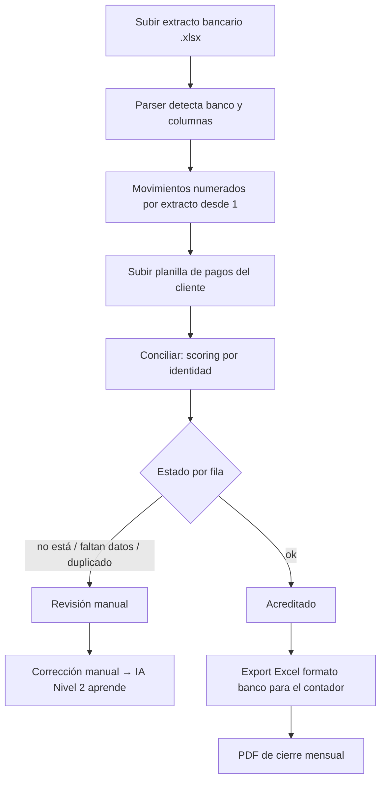
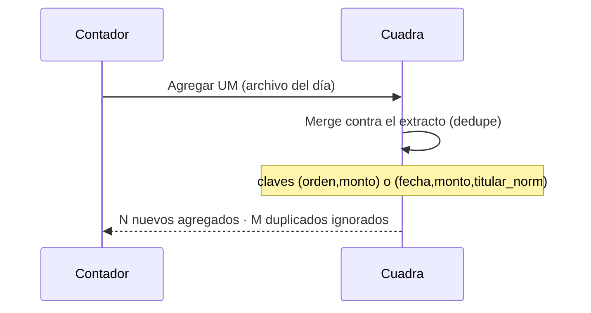
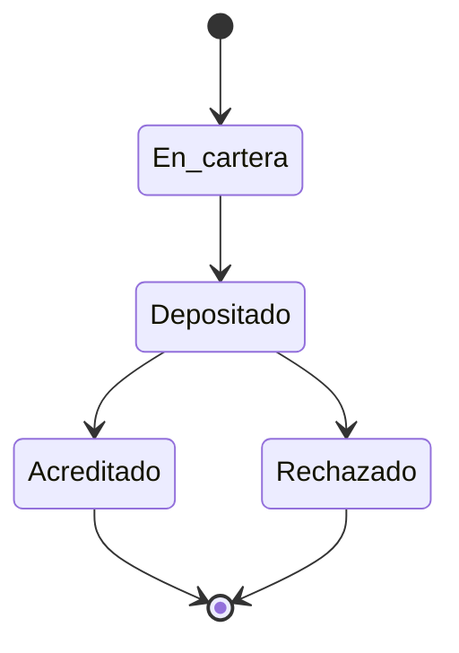
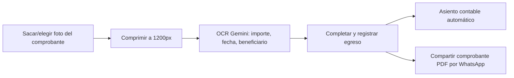

# WORKFLOWS — Flujos de usuario end-to-end

> Recorridos completos del usuario por los módulos principales. Las reglas que rigen cada paso
> están en [BUSINESS_RULES](./BUSINESS_RULES.md); el motor contable en
> [ACCOUNTING_ENGINE](../architecture/ACCOUNTING_ENGINE.md).

## 1. Conciliación mensual (flujo central)

1. Julieta recibe el extracto mensual (Excel del banco) y lo sube (`/extractos/upload`).
2. El contador envía "Últimos Movimientos" (UM) que se agregan sin duplicar (ver §2).
3. Los clientes envían sus planillas de pagos; se suben y se concilian (`/planillas/upload` +
   conciliación).
4. El sistema asigna un estado a cada fila por scoring (ver [BUSINESS_RULES](./BUSINESS_RULES.md)).
5. Se revisan las filas que no quedaron `ok`, se corrigen a mano (alimenta la IA Nivel 2).
6. Se exporta el Excel en formato del banco para el contador y el PDF de cierre.

## 2. UM diario (Últimos Movimientos)

El extracto se va engrosando día a día sin duplicar movimientos. Ver `services/extracto_merger.py`
y [BUSINESS_RULES](./BUSINESS_RULES.md) (deduplicación).

## 3. Ciclo de vida de un cheque

Alta del cheque (portador, librador, banco, monto, fecha de depósito), depósito, acreditación o
rechazo. Alertas de vencimiento ≤3 días (scheduler 10:00). Ver `routers/cheques*.py` y la página
`Cheques.tsx`.

## 4. Registrar pago/gasto con foto + OCR + compartir

Ver `pages/Pagos.tsx`, `routers/pagos.py`, [AI_GUIDE](../ai/AI_GUIDE.md) (OCR) y
[UX_RULES](../ux/UX_RULES.md) (compartir/lock).

## 5. Liquidación de comisiones + cierre de período

1. Se calcula la liquidación de comisiones por cliente/período (`routers/liquidaciones.py`).
2. Estados `borrador` → aprobada; la aprobación genera asiento contable.
3. El cierre de período (`services/cierre_periodo.py`) puede dejar el período inmutable.

## 6. Liquidación de impuestos (IVA / Monotributo / IIBB / Sueldos)

Patrón común de los 4 módulos: configuración opt-in por organización → cálculo/proyección a partir
de los asientos contables ya registrados → snapshot por período → marcar como presentado/revisado
deja el snapshot **inmutable**. Ver [BUSINESS_RULES](./BUSINESS_RULES.md) y las páginas
`Iva.tsx`, `Monotributo.tsx`, `IngresosBrutos.tsx`, `Sueldos.tsx`.

## Pendiente de revisar

- Los estados exactos de cheques y liquidaciones se representan en código con strings; verificar la
  lista canónica contra los modelos antes de tratar estos diagramas como contractuales.
